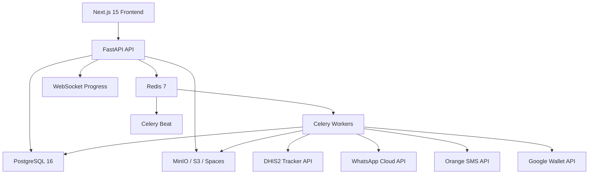

# Technical Architecture - OOMUS eHealth CampaignID v3.5

## Vue d'ensemble

## Composants

- Next.js 15 expose l'interface frontend.
- FastAPI expose les endpoints REST et WebSocket.
- PostgreSQL stocke utilisateurs, programmes, campagnes, jobs, vouchers, transactions et tarifs.
- Redis sert de broker et backend de resultats Celery.
- Celery execute generations, synchronisations DHIS2 et distributions.
- Celery Beat planifie les synchronisations automatiques.
- MinIO, AWS S3 ou DigitalOcean Spaces stockent les artefacts.
- DHIS2 Tracker fournit les donnees programmes.
- WhatsApp, SMS et Google Wallet distribuent les cartes.

## Stack v3.5

| Couche | Technologies |
| --- | --- |
| Frontend | Next.js 15, TypeScript 5, Tailwind CSS v4 |
| Backend | FastAPI 0.115, SQLAlchemy 2, Pydantic v2 |
| Base de donnees | PostgreSQL 16 |
| Queue | Celery 5 + Redis 7 |
| Stockage | MinIO, AWS S3, DigitalOcean Spaces |
| PDF/QR | Pillow, ReportLab, qrcode |
| IA | scikit-learn IsolationForest |
| Securite | cryptography, JWT, AES-256 |
| Monitoring | Flower, WebSocket, logs temps reel |

## Principes techniques

- SQLAlchemy 2 async pour les operations API.
- Taches longues hors du cycle HTTP.
- Artefacts references par cle de stockage.
- URLs de telechargement generees a la demande.
- Multi-tenant par programme, organisation ou client.
- Verification offline a partir de registres cryptographiques.
- Auditabilite par SHA-256 et chainage des generations.
